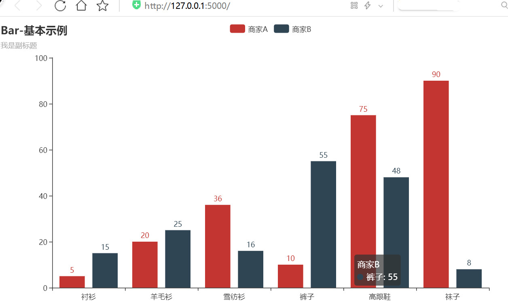
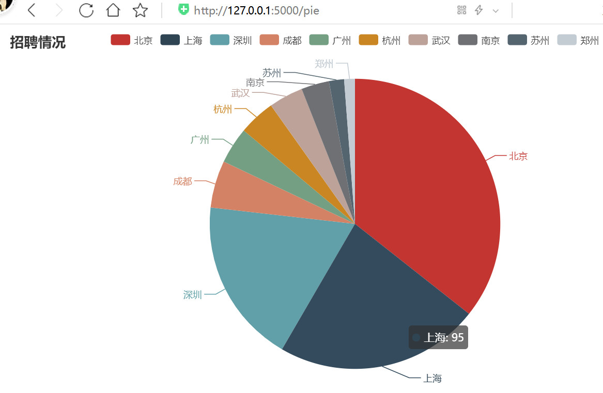
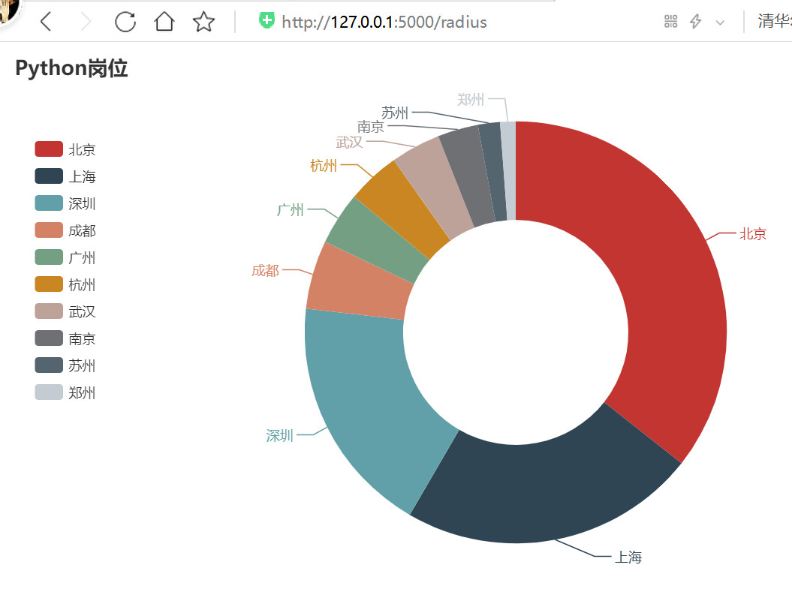
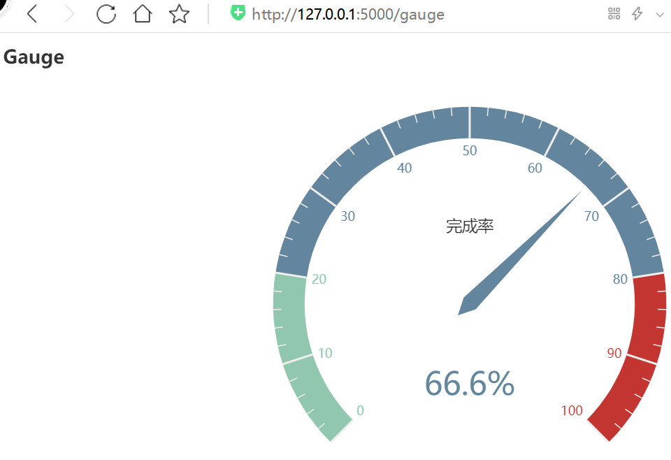

### 使用说明：

1.需要连接数据库使用。

2.web.py为服务器文件，framework.py为框架层。route目录中为模拟django路由列表方式，
根目录为带装饰器方式模拟Flask的router。

3.要使用加载了数据库方面的html，在本地要先建立一个stock_db的数据库，然后执行source stock_db.sql.

4.修复了Linux与Wondows页面加载问题。

5.新增Flask模板，默认启动http://127.0.0.1:5000/ 。封装了柱形图，饼图，仪表盘图等。

显示效果如下：

**柱形图：**

**饼图：**

**radius饼图：**

**仪表盘图：**

