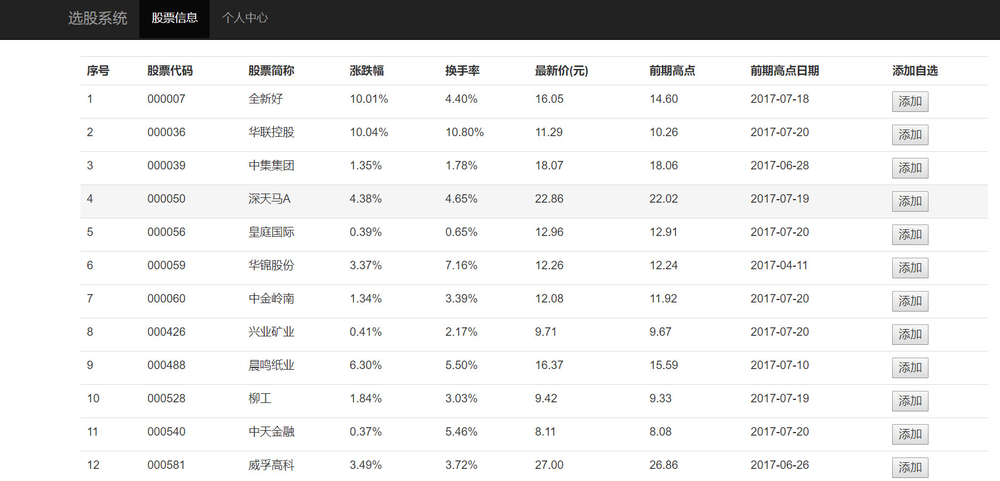
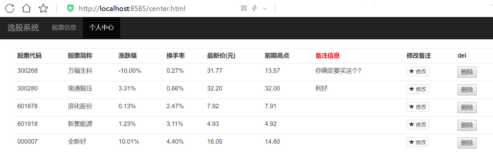

### 使用说明：

1.运行根目录下的web.py,服务器绑定在8585端口，可手动修改，首页为股票信息。

**个人中心页面：**

2.`web.py`为服务器文件，`framework.py`为框架层。`route`目录中为模拟`django`路由列表方式，
根目录为带装饰器方式模拟Flask的router。

3.要使用加载了数据库方面的html，在本地要先建立一个`stock_db`的数据库，然后执行`source stock_db.sql.`

4.修复了Linux与Wondows页面加载问题。

5.新增Flask模板，默认启动http://127.0.0.1:5000/ 。封装了柱形图，饼图，仪表盘图等。

显示效果如下：

**柱形图：**

**饼图：**

**radius饼图：**

**仪表盘图：**

